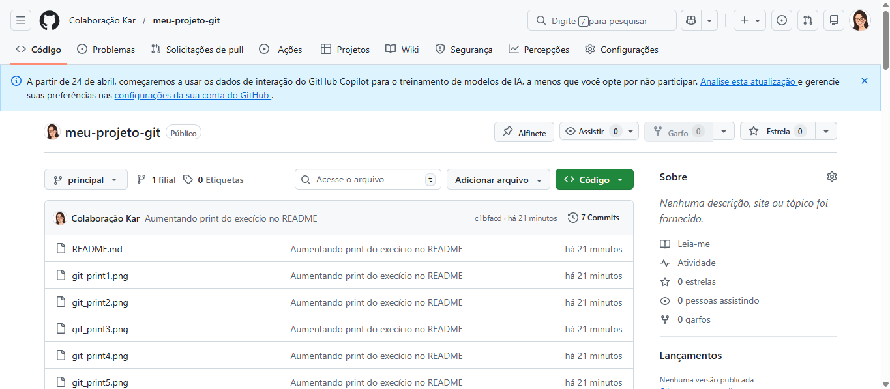
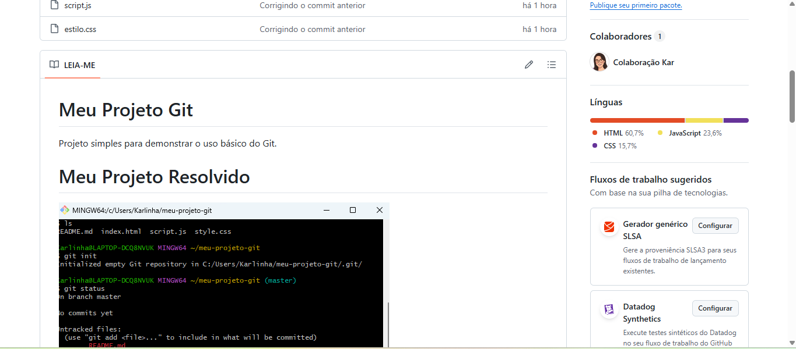

# Meu Projeto Git

Projeto simples para demonstrar o uso básico do
Git.

# Meu Projeto Resolvido

# Git Status
## Verificação dos arquivos na Stage Area. Primeiro, o Git identifica as alterações pendentes (em vermelho) e, após o commit, confirma que a árvore de trabalho está limpa.

# Git log --oneline
## Serve para mostrar o passado, ou seja, o histórico de todos os "checkpoints" (commits) que você já criou.

# Criação da branch
## Criação de um novo ramo de trabalho independente. Este comando permite desenvolver novas funcionalidades (como a melhoria do README) sem afetar a versão principal do código.

# Pull Request no GitHub
## Abertura da solicitação de integração no GitHub. Momento em que o código da branch rascunho é enviado para revisão antes de ser mesclado à branch principal (main). Após clicar nele apareceu o botão "Mesclar solicitação de pull" como aparece abaixo.

# Conflito aparecendo
## Identificação de conflito pelo Git. Ocorreu porque o mesmo arquivo foi alterado simultaneamente na branch e na main, exigindo uma intervenção manual para decidir qual versão manter.

# Conflito resolvido
## Resolução manual do conflito no editor de código. As marcações do Git foram removidas e a versão final foi consolidada e salva com um novo commit de merge.

# Repositório final no GitHub
## Visão geral do projeto concluído no GitHub. O repositório exibe todos os arquivos organizados, o histórico de commits atualizado e o README formatado com toda a documentação.

